# Laboratorio práctico de EC2 Linux

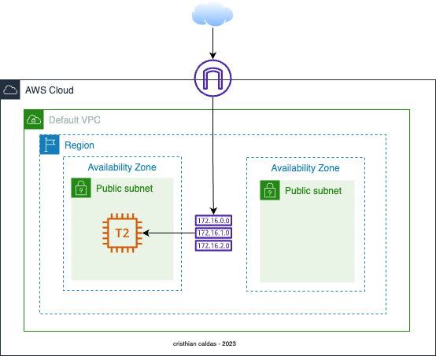

<br>

---
### Objetivo: 
* Identificación de los componentes "User Data" y "Metadata"
* Identificación de caracteristicas en EC2

### Actividades a realizar :

1. Crear un par de claves nuevas.
2. Lanzar una instancia de servidor web.
3. Conectarse a la instancia de Linux.
4. Conectarse a la instancia de EC2 mediante PuTTY (Opcional).


## 1 - Crear un par de claves nuevas.

* Inicie sesión en la consola de administración de AWS y abra la  [consola de Amazon EC2](https://console.aws.amazon.com/ec2). En la esquina superior derecha de la consola de administración de AWS, confirme que se encuentra en la región de AWS deseada.

* Haga clic en Key Pairs (Pares de claves) en la sección Network & Security (Red y seguridad) en la parte inferior del menú de la izquierda aparecerá una página para administrar los pares de claves SSH.

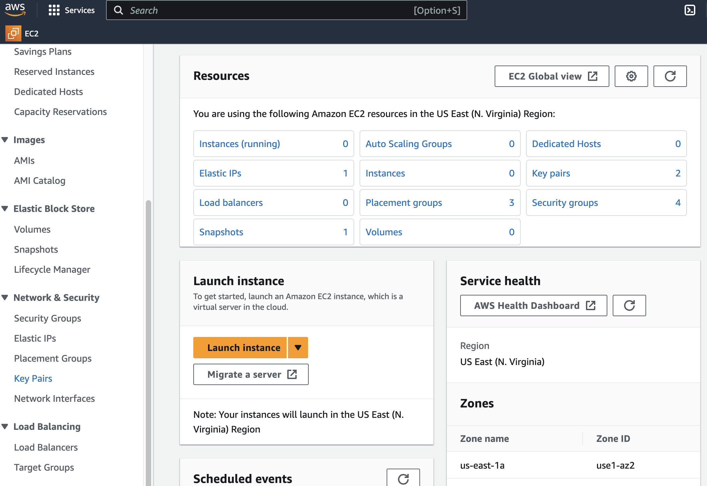

<br>
* Para crear un nuevo par de claves SSH, haga clic en el botón Create key pair (Crear par de claves).
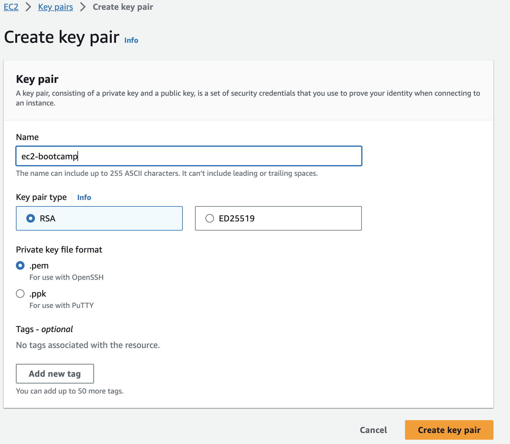
<br>

* Escriba ec2-bootcamp en el cuadro de texto Key Pair Name (Nombre del par de claves) y haga clic en el botónCreate key pair (Crear par de claves). Si utiliza Windows, seleccione .ppk como formato de archivo.

* La página descargará el archivo ec2-bootcamp.pem a la unidad local. Siga las instrucciones del navegador para guardar el archivo en la ubicación de descarga predeterminada. Recuerde la ruta completa al archivo del par de claves que acaba de descargar.

## 2 - Lanzar una instancia de servidor web
Lanzaremos una instancia de Amazon Linux 2,donde arrancaremos Apache/PHP e instalaremos una página web básica que mostrará información sobre nuestra instancia.

* Haga clic en EC2 Dashboard (Panel de EC2) cerca de la parte superior del menú de la izquierda. Luego, haga clic en Launch instances (Lanzar instancias).
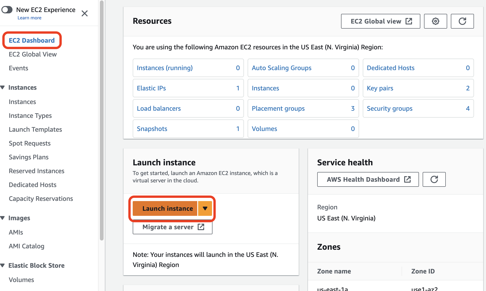
* En Name (Nombre), ponga el valor ec2-bootcamp . Luego, compruebe la configuración predeterminada de Imagen de máquina de Amazon Linux.
  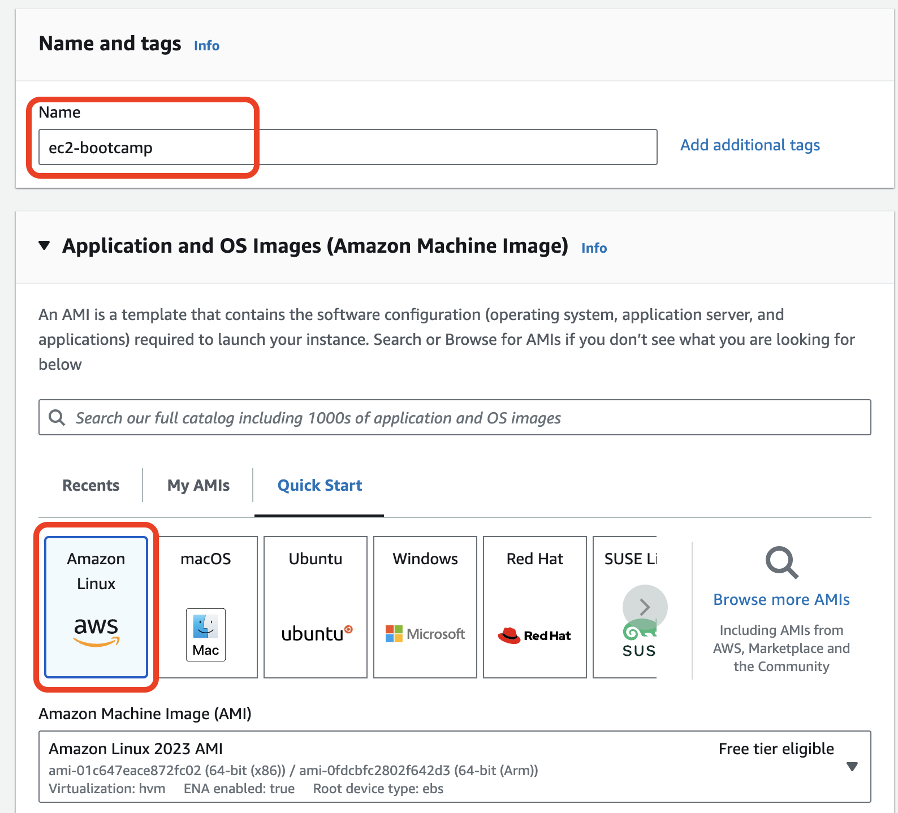
* Seleccione t2.micro en Instance Type (Tipo de instancia).
  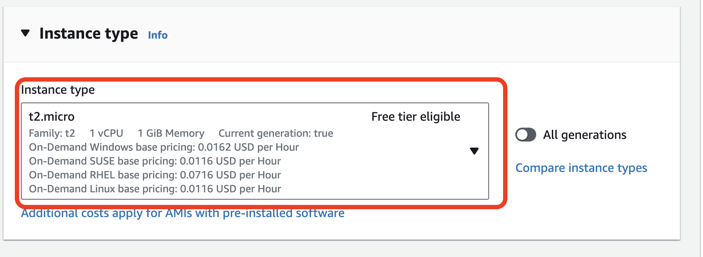
* Seleccione el par de claves que creó al comienzo de este laboratorio en el menú desplegable.
  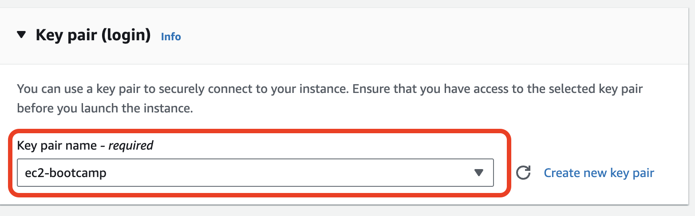
* Haga clic en el botón Edit (Editar) en Network settings (Configuración de red) para establecer en que VPC se ubicará la EC2.

* Compruebe la VPC predeterminada y la subred. Auto-assign public IP (Asignar automáticamente la IP pública) está configurada en Enable (Habilitar). Justo debajo, cree grupos de seguridad para que actúen como un firewall de la red. Los grupos de seguridad especificarán los protocolos y las direcciones que desea permitir en la política de firewall. Para el grupo de seguridad que está creando en este momento, esta es la regla que se aplica al EC2 que se creará. Después de ingresar SG-WebServer en el nombre y la descripción del grupo de seguridad, seleccione Add Security group rule (Agregar regla de grupo de seguridad) y establezca HTTP en Tipo.

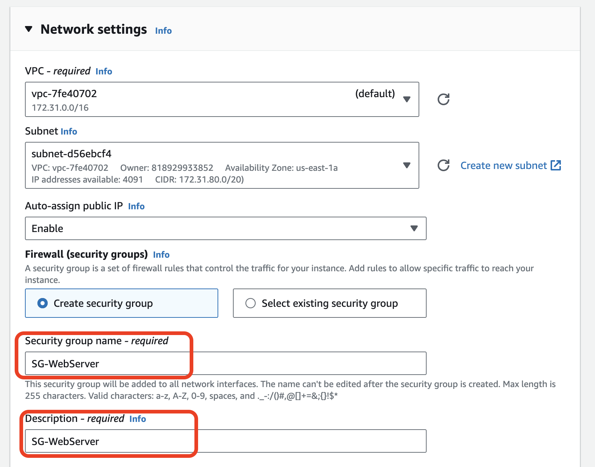

* Además, especifique y permita TCP/80 para el servicio web. Seleccione My IP (Mi IP) en el origen.

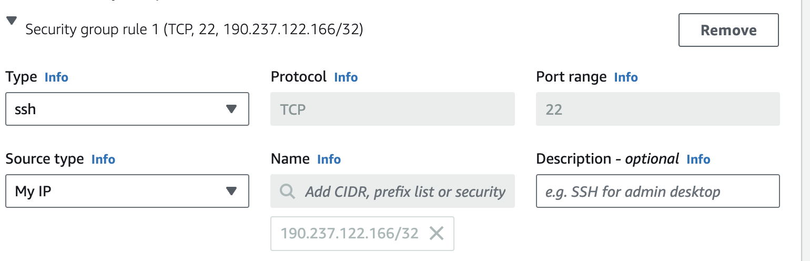

 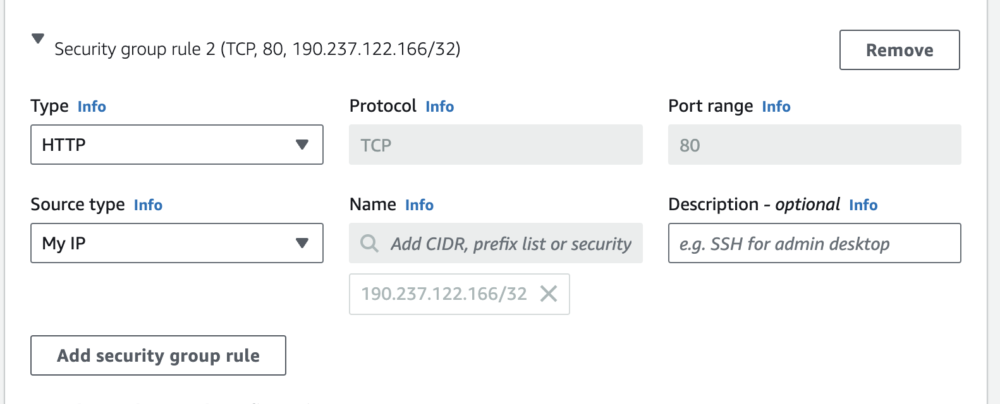

* Todos los demás valores aceptan los valores predeterminados, haga clic en la pestaña Advanced Details (Detalles avanzados) en la parte inferior de la pantalla para ampliarlos. Ingrese los siguientes valores en el campo User data (Datos de usuario) y seleccione Launch instance (Lanzar instancia).
  
   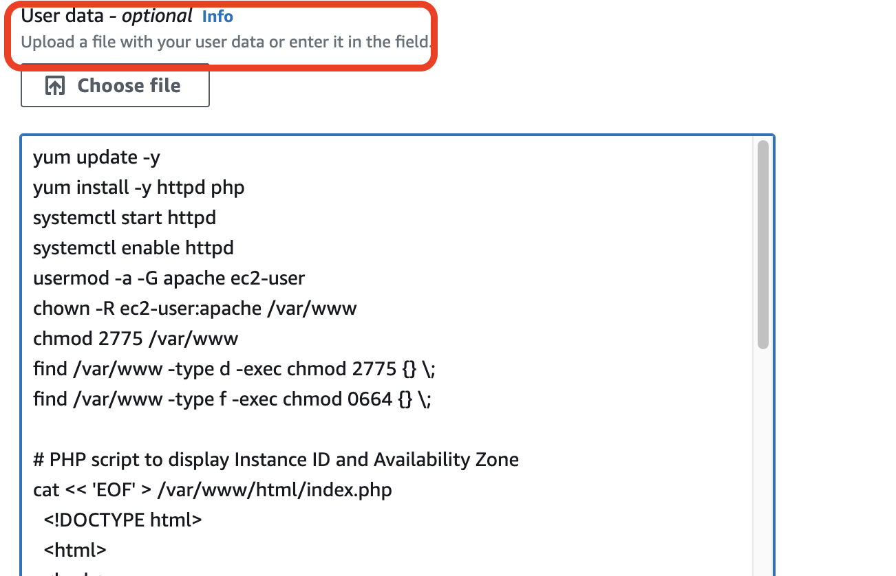
 
```bash
#!/bin/bash
yum update -y
yum install -y httpd php
systemctl start httpd
systemctl enable httpd
usermod -a -G apache ec2-user
chown -R ec2-user:apache /var/www
chmod 2775 /var/www
find /var/www -type d -exec chmod 2775 {} \;
find /var/www -type f -exec chmod 0664 {} \;

#  Instance ID and Availability Zone
cat << 'EOF' > /var/www/html/index.php
  <!DOCTYPE html>
  <html>
  <body>
    <center>
      <?php
      # Get the instance ID from meta-data and store it in the $instance_id variable
      $url = "http://169.254.169.254/latest/meta-data/instance-id";
      $instance_id = file_get_contents($url);
      # Get the instance's availability zone from metadata and store it in the $zone variable
      $url = "http://169.254.169.254/latest/meta-data/placement/availability-zone";
      $zone = file_get_contents($url);
      ?>
      <h2>EC2 Instance ID: <?php echo $instance_id ?></h2>
      <h2>Availability Zone: <?php echo $zone ?></h2>
    </center>
  </body>
  </html>
EOF
```

* Haga clic en el botón View Instances (Ver instancias) en la parte inferior derecha de la pantalla para ver la lista de instancias de EC2. Una vez que se haya lanzado la instancia, verá su servidor web, en la zona de disponibilidad en la que se encuentra la instancia y el nombre de DNS que se puede enrutar públicamente. Haga clic en la casilla de comprobación situada junto a su servidor web para ver los detalles de esta instancia de EC2.

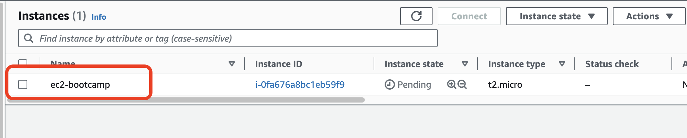

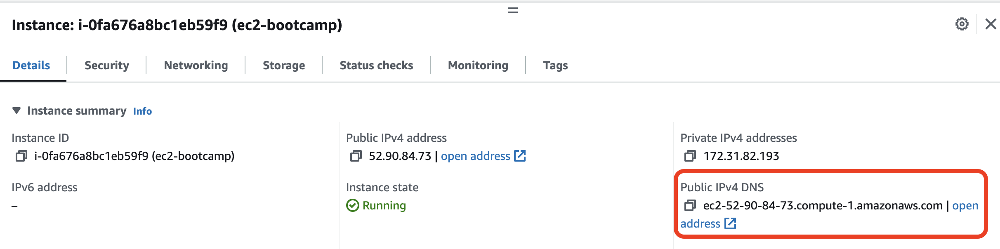

* Espere a que la instancia pase las comprobaciones de estado para terminar de cargarse. Abra una pestaña del navegador nueva e ingrese el nombre de DNS público de la instancia de EC2 para navegar por el servidor web. El nombre de DNS público de la instancia de EC2 se puede encontrar en la consola si se revisa la línea de nombre de Public IPv4 DNS (DNS IPv4 público) que se señaló anteriormente. Verá un sitio web similar al siguiente.
  
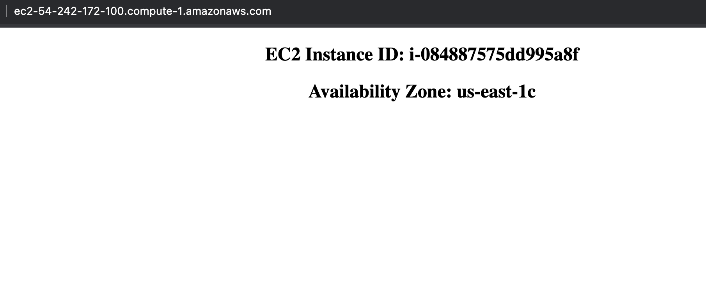


## 3 - Conectarse a la instancia de Linux
* En la consola de instancias de EC2, seleccione la instancia a la que desea conectarse y, luego haga clic en el botón Connect (Conectar).
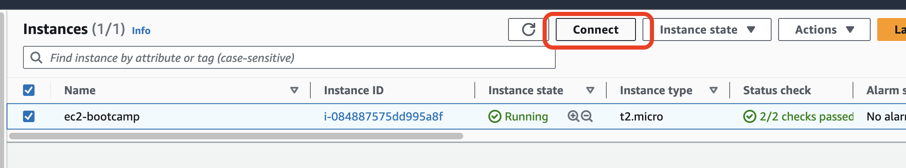
* En la página Connect to instance (Conectarse a la instancia), seleccione SSH client (Cliente SSH). Siga las instrucciones que aparecen a continuación.
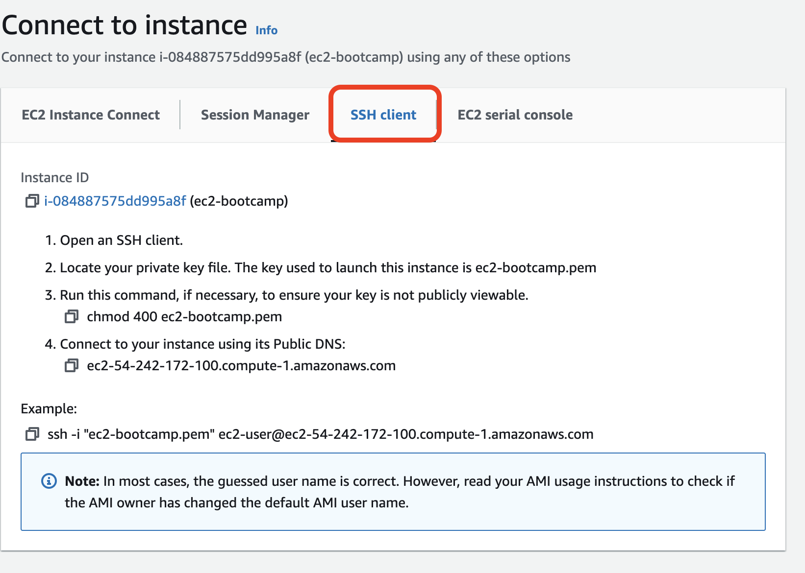
* Navegue hasta donde se encuentra su clave privada e ingrese el siguiente comando. Reemplace [su nombre] por el nombre que especificó antes de crear la clave.
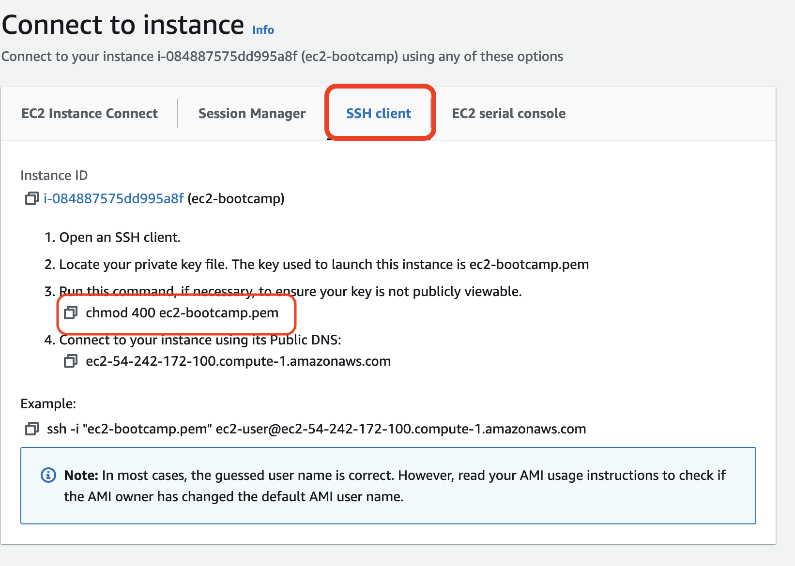

```bash
chmod 400 ec2-bootcamp.pem
```

```bash
ssh -i "ec2-bootcamp.pem" ec2-user@ec2-54-242-172-100.compute-1.amazonaws.com
```

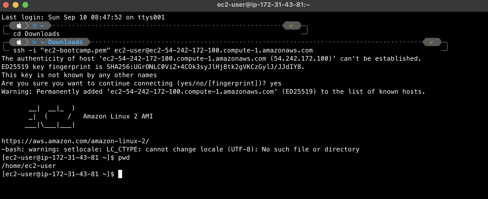

## 4 - Conectarse a la instancia de EC2 mediante PuTTY (Opcional)

* Inicie PuTTY si necesita descargar PuTTY.

* En el panel Category (Categoría), elija Session (Sesión).

* En el cuadro Host name (Nombre de host), ingrese ec2-user@[la IP pública de EC2 que creó].

* Establezca el valor de Port (Puerto) en 22.

 

* En Connection type (Tipo de conexión), seleccione SSH. 

* En el panel Category (Categoría), expanda Connection (Conexión), expanda SSH y, luego, elija Auth. Complete lo siguiente:

   - Elija Browse (Examinar).
   - Seleccione el archivo .ppk que generó para el par de claves y elija Open (Abrir).

* Si es la primera vez que se conecta a esta instancia, PuTTY muestra un cuadro de diálogo de alerta de seguridad que pregunta si confía en el host al que se está conectando. Elija Yes (Sí). Se abrirá una ventana, se iniciará sesión como ec2-user y se conectará a la instancia.
