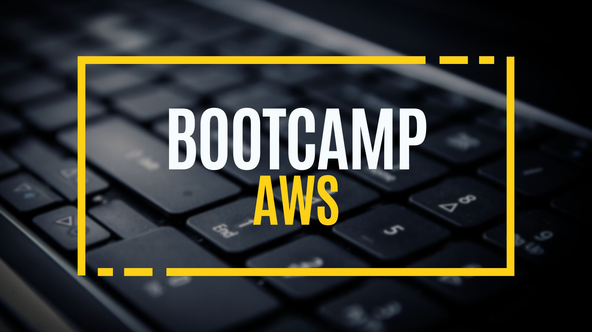

# Bootcamp AWS Desde Cero 🔥 🔥 
### by CristhianCaldas

### ¿Pero por que aprender AWS? 
Ya seas un desarrollador, un profesional de TI o un líder empresarial, aprender AWS puede brindarte un valioso conjunto de habilidades que puede ayudarlo a avanzar en tu carrera e impulsar la innovación en tu organización.

Cabe mencionar que la demanda de computación en la nube continúa creciendo,
también lo hace la necesidad de profesionales calificados que puedan administrar y utilizar de manera efectiva plataformas en la nube como Amazon Web Services (AWS).

Según la firma de investigación Gartner:

AWS posee casi el 32 % de la cuota de mercado global de servicios de infraestructura en la nube,lo que la convierte en la plataforma en la nube más utilizada.
 
Es decir que un número significativo de empresas ya están usando o planean usar AWS y como resultado,existe una gran demanda de profesionales con habilidades en AWS.

 
 
 
Este Bootcamp está destinado a cualquier persona interesada en iniciar una carrera en Cloud Computing ya que cuenta con un módulo inicial con los siguientes temas:
    
  + Arquitectura básica de computadoras
  + Modelo cliente servidor
  + Diseño de aplicaciones web
  + Fundamentos redes
  + Conceptos básicos de almacenamiento

### Contenidos && Challenge

  1. Roadmap BootCamp
        * [Intro DevOps](./CLASE-01/README.md)

    
  1. Linux Básico 
        * [Linux](./CLASE-02/README.md)
        * [Comandos Basicos](./CLASE-02/README.md)
        * [Bash](./CLASE-02/README.md)

 

_ _ _

#### 🔔 Importante: Se actualiza contenido a medida que avance el curso Bootcamp AWS Desde Cero
_ _ _

## Contribuciones
Como siempre, cualquier contribución es bienvenida, simplemente forkeá este repo y enviame una PR.  
