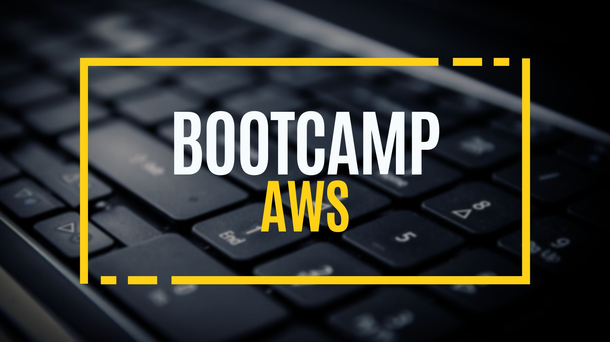
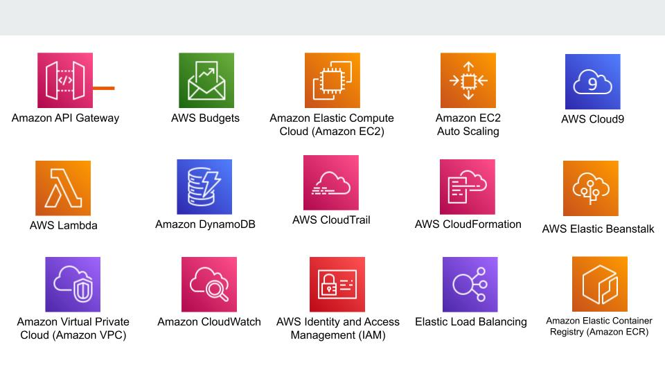

# Bootcamp AWS Desde Cero 🔥 🔥

### by CristhianCaldas

## ¿Pero por que aprender AWS?

Ya seas un desarrollador, un profesional de TI o un líder empresarial, aprender **AWS** puede brindarte un valioso conjunto de habilidades que puede ayudarlo a avanzar en tu carrera e impulsar la innovación en tu organización.

Cabe mencionar que la demanda de computación en la nube continúa creciendo,también lo hace la necesidad de profesionales calificados que puedan administrar y utilizar de manera efectiva plataformas en la nube como **Amazon Web Services (AWS)**.

Según la firma de investigación Gartner:

+ AWS posee casi el 32 % de la cuota de mercado global de servicios de infraestructura en la nube , lo que la convierte en la plataforma en la nube más utilizada.
+ Es decir que un número significativo de empresas ya están usando o planean usar AWS y como resultado , existe una gran demanda de profesionales con habilidades en **AWS**.

## Público objetivo

Este Bootcamp está destinado a cualquier persona interesada en iniciar una carrera en Cloud Computing ya que cuenta con un módulo inicial con los siguientes temas:

+ Arquitectura básica de computadoras.
+ Modelo cliente servidor.
+ Diseño de aplicaciones web.
+ Fundamentos redes.
+ Conceptos básicos de almacenamiento.

## Servicios a Utilizar

## Contenidos

1. **Fundamentos Cloud**

   + Conceptos Cloud.
   + Introducción a AWS.
   + Infraestructura Global.
   + Creación de nuestro primer AWS Budget.

2. **Seguridad**

   + Introducción a IAM.

3. **Cómputo**

   + Uso básico del AWS CLI.
   + Introducción a Amazon EC2.
   + Trabajando con Amazon Machine Images (AMIs).
   + Introducción a AWS Auto Scaling.

4. **Almacenamiento**

   + Amazon EBS.
   + Amazon Elastic File System (EFS).
   + Amazon S3.

5. **Bases de datos**

   + Vista general de bases de datos en AWS.
   + Amazon RDS.
   + Amazon DynamoDB.

6. **Redes**

   + Amazon VPC.

7. **Observabilidad**

   + Amazon CloudWatch.
   + Amazon CloudTrail.

8. **Modernización**

   + Introducción al paradigma Serverless.
   + AWS Lambda.
   + APIs con Amazon API Gateway.

9. **Automatización**

   + AWS CloudFormation.

---

#### 🔔🔔 Importante: Se actualiza el contenido a medida que avance el Bootcamp AWS Desde Cero.🔔🔔

---

## Contribuciones

Como siempre, cualquier contribución es bienvenida, simplemente forkeá este repo y enviame una PR